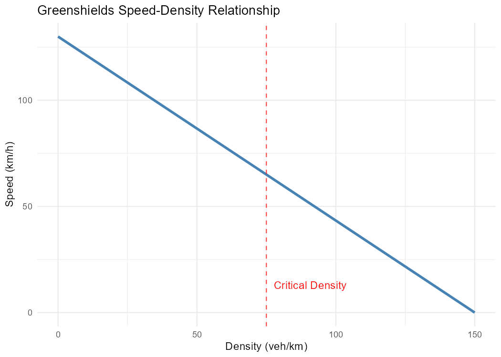

# trafficflow

<!-- badges: start -->
[](https://github.com/MartinHoblisch/trafficflow/actions/workflows/R-CMD-check.yaml)
[](https://lifecycle.r-lib.org/articles/stages.html#experimental)
<!-- badges: end -->

## Overview

trafficflow provides a clean implementation of the Greenshields traffic flow model, one of the fundamental models in transportation engineering. The package enables calculation of speed-density relationships, traffic flow rates, and optimal density conditions for highway operations.

**Key features:**

- Calculate vehicle speeds from traffic density using the linear Greenshields model
- Compute traffic flow (vehicles per hour) from density measurements
- Find critical density points that maximize traffic throughput
- Vectorized operations for efficient batch calculations
- Built-in visualisation of speed-density relationships

## Installation

This is currently a learning project. You can install and test locally:
``` r
# Clone the repository
git clone https://github.com/MartinHoblisch/trafficflow.git

# Load in R
devtools::load_all("path/to/trafficflow")
```

Once stabilized, install directly from GitHub:
``` r
# install.packages("devtools")
devtools::install_github("MartinHoblisch/trafficflow")
```

## Usage

### Basic calculations

Calculate speed from traffic density using default parameters
(free-flow speed: 130 km/h, jam density: 150 veh/km):
``` r
library(trafficflow)

# Speed at low density (sparse traffic)
greenshields(density = 20)
#> [1] 112.6667

# Speed at high density (congested traffic)
greenshields(density = 120)
#> [1] 26
```

### Traffic flow analysis
``` r
# Flow at various densities
flow_from_density(density = c(25, 50, 75, 100))
#> [1] 2708.333 4333.333 4875.000 4333.333
```

### Finding optimal conditions
``` r
critical_density()
#>   critical_density speed_at_critical max_flow
#> 1               75                65     4875
```

### Visualisation
``` r
plot_greenshields()
```



The red dashed line marks the **critical density** (75 veh/km) at which 
traffic flow is maximized. Beyond this point, increasing density reduces 
throughput despite more vehicles being present.

### Custom parameters
``` r
# Urban arterial
greenshields(density = 40, free_flow_speed = 60, jam_density = 200)
#> [1] 48

# Highway
greenshields(density = 40, free_flow_speed = 120, jam_density = 120)
#> [1] 80
```

### Vectorized operations
``` r
densities <- seq(0, 150, by = 25)
data.frame(
  density = densities,
  speed   = round(greenshields(densities), 1),
  flow    = round(flow_from_density(densities), 0)
)
#>   density speed flow
#> 1       0 130.0    0
#> 2      25 108.3 2708
#> 3      50  86.7 4333
#> 4      75  65.0 4875
#> 5     100  43.3 4333
#> 6     125  21.7 2708
#> 7     150   0.0    0
```

## Background

The Greenshields model (1935) assumes a linear relationship between 
traffic speed and density:

**v = v<sub>f</sub> × (1 - k/k<sub>jam</sub>)**

Where:
- **v** = speed at given density (km/h)
- **v<sub>f</sub>** = free-flow speed with no congestion (km/h)
- **k** = traffic density (vehicles/km)
- **k<sub>jam</sub>** = jam density when traffic stops (vehicles/km)

Traffic flow is then: **q = k × v**

The model predicts that maximum flow occurs at exactly half the jam 
density, a key insight for capacity planning.

## Functions

| Function | Purpose |
|----------|---------|
| `greenshields()` | Calculate speed from density |
| `flow_from_density()` | Calculate traffic flow rate |
| `critical_density()` | Find optimal density for max flow |
| `plot_greenshields()` | Visualise speed-density relationship |

## Development

This package was developed as a learning project for R package 
development, focusing on:

- Clean function design with sensible defaults
- Comprehensive unit testing with testthat (21 tests)
- Roxygen2 documentation
- Vectorized operations
- GitHub Actions CI/CD
- ggplot2 visualisation

## License

MIT © Martin Mac

## References

Greenshields, B. D. (1935). A study of traffic capacity. 
*Highway Research Board Proceedings*, 14, 448-477.